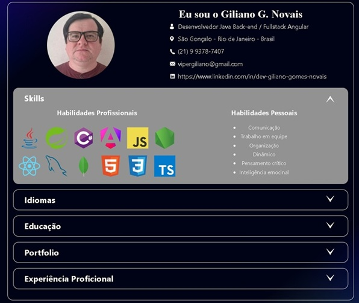
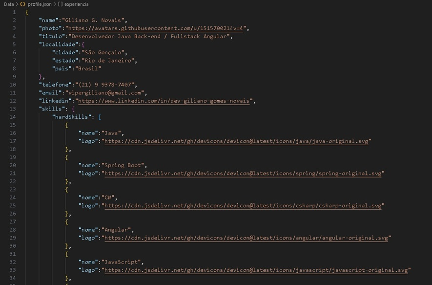

# 💻 JS Developer Portfolio - Giliano G. Novais



Este é um projeto de Portfólio Dinâmico desenvolvido para consolidar e exibir minhas competências como desenvolvedor, unindo minha sólida bagagem em planejamento técnico à tecnologia moderna de software. O diferencial deste projeto é que todo o conteúdo é alimentado dinamicamento por uma "API local" em JSON.

## 🚀 Tecnologia Utilizadas
* __HTML5__: Estruturação semântica de dados.
* __CSS3__: Layouts modernos com Custom Properties, Flexbox e Gradientes lineares dinâmicos.
* __JavaScript (ES6+)__: Manipulação assíncrona do DOM utilizando _fetch_ e _Async/Await_.
* __JSON__: Armazenamento e estruturação de dados de perfil.

## ⚙️ Funcionalidades


* __Consumo de API Local__: Os dados de perfil, experiências e skills são lidos de um arquivos _profile.json_, facilitando a manutenção.
* __Acordeon Interativo__: Interface organizada que permite expandir e recolher seções de informações de forma fluida.
* __Design Responsivo__: Adaptado para diferentes resoluções, garantindo uma boa experiência em mobile e desktop.
* __Injeção Dinâmica de HTML__: Funções JavaScript que mapeiam arrays de dados e geram elementos de lista automaticamente para Skills e Experiências.

## 📂 Estrutura do Projeto

```Plaintext
├─── Assets/
│     ├─── CSS/             # Estilização (style, acordeon, normalizar)
│     ├─── js/              # Lógica (api, main, acordeon)
│     └─── image/           # Ativos visuais (fotos e ícones)
├─── Data/
│     └─── profile.json     # "Banco de dados" do portfólio
└─── index.html             # Página principal
```
## 🧠 Sobre o Autor
Sou __Giliano G. Novais__, graduando em Análise e Desenvolvimento de Sistemas. Com mais de 15 anos de experiência em planejamento técnico e coordenação, estou transicionando para o desenvolvimento __Fullstack (Java/Angular)__, trazendo foco em eficiência, cumprimento de prazos e pensamento crítico para o código.